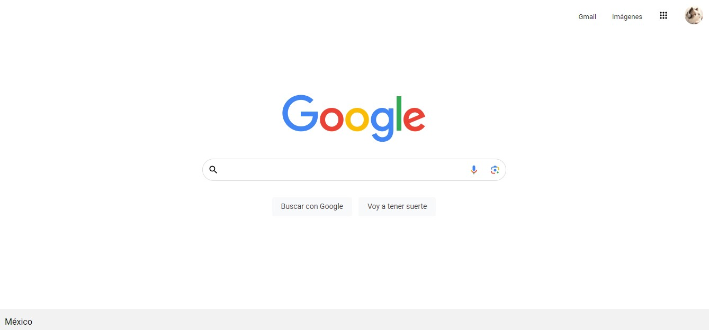

# Clon de Página Principal de Google

El presente proyecto es una página es un ejercicio de una página web, tomando como referencia el sitio principal del búscador de Google para el bootcamp de desarrollo frontend de Technolochicas PRO.
Fue desarrollado con HTML y CSS.

[Proyecto Desplegado (https://plusalo.github.io/ClonG/)](https://plusalo.github.io/ClonG/)
## Secciones de mi sitio

## Tecnologías
* HTML
* CSS
---
Desarrollado con 💜 por [Alondra](https://github.com/PLUSAlo/ClonG) en [TECHNOLOCHICAS PRO](https://tecnolochicas.mx/).